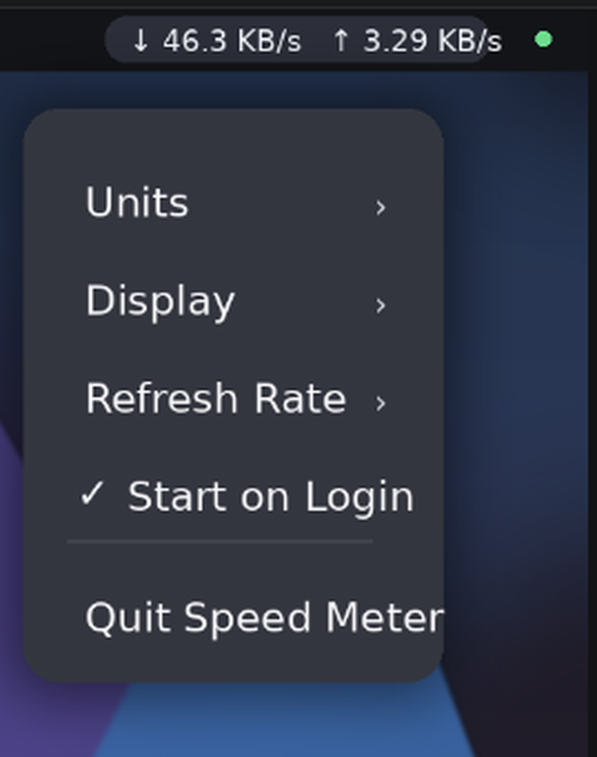

# Linux Network Speed Indicator

Linux Network Speed Indicator is a lightweight Linux network speed monitor for Ubuntu GNOME, Debian GNOME, and other desktops that support AppIndicator or StatusNotifier items. It shows live download and upload bandwidth in the top bar or tray, remembers user settings, supports autostart, and ships as a simple `.deb` package.

If you want a native-feeling Ubuntu or Linux bandwidth monitor without a heavy system monitor panel, this project is built for that exact use case.

## Features

- Live download and upload speed in the Linux top bar or tray
- Split, download-only, upload-only, or total bandwidth views
- Automatic unit scaling plus fixed `KB/s`, `MB/s`, and `GB/s` modes
- Persistent settings for units, display mode, and refresh rate
- Autostart support for Ubuntu GNOME and other compatible Linux desktops
- Debian package, desktop launcher, AppStream metadata, and MIT licensing
- Flatpak manifest and local Flatpak build script for Flathub-style packaging work

## Screenshots

### Indicator in Top Bar


### Indicator Menu



## Supported Linux Desktops

- Ubuntu GNOME 24.04 and newer
- Ubuntu 26.04 GNOME
- Debian GNOME
- Other Linux desktops with AppIndicator or StatusNotifier support

GNOME note:

- GNOME needs an AppIndicator host in the top bar.
- Ubuntu already ships that by default through the Ubuntu AppIndicators extension.

## Download and Install

Right now, the public download is GitHub Releases only. The project is not published on Flathub, Snap Store, AUR, COPR, or other Linux software stores yet.

1. Open the GitHub Releases page for Linux Network Speed Indicator.
2. Download the latest `.deb` file.
3. Install it with:

```bash
sudo apt install ./linux-network-speed-indicator_<version>_all.deb
```

`apt` is the recommended install method because it resolves the required dependencies automatically.

## After Install

- The network speed indicator appears in the top bar or tray area.
- It starts automatically on login.
- Click the indicator to change units, display mode, refresh interval, or autostart.

## What the Indicator Shows

- `↓` current download speed
- `↑` current upload speed
- `⇅` combined network throughput

Available unit modes:

- Automatic `KB/s`, `MB/s`, and `GB/s`
- Fixed `KB/s`
- Fixed `MB/s`
- Fixed `GB/s`

## Linux Software Store Readiness

The project now ships the metadata expected by AppStream-based Linux software centers:

- desktop launcher metadata
- application icon in the standard hicolor theme path
- AppStream metainfo for store indexing
- AppStream screenshot assets for software center listings

That improves readiness for GNOME Software, KDE Discover, Ubuntu App Center, and other Linux app stores that consume AppStream data once the package is published in a compatible repository.

The repository now also includes a Flatpak manifest for `io.github.MasumMSNR.LinuxNetworkSpeedIndicator`, which is the packaging base needed for Flathub review. Flathub submission still may need review-specific polish, but the screenshot asset gap is now covered in the repo.

## Flatpak Build

To build a local Flatpak bundle from this repository:

```bash
./scripts/build-flatpak.sh
flatpak install --user dist/io.github.MasumMSNR.LinuxNetworkSpeedIndicator.flatpak
flatpak run io.github.MasumMSNR.LinuxNetworkSpeedIndicator
```

Flatpak notes:

- the Flatpak build shares the host network namespace so `/proc/net/dev` reflects real host traffic
- the tray icon requests narrow access to `org.kde.StatusNotifierWatcher`
- the autostart toggle is intentionally disabled inside Flatpak because sandboxed autostart entries do not control the host session

For broader Linux distribution later, the next packaging targets after Flatpak would be Snap for Snap Store, AUR for Arch Linux, or COPR for Fedora-based users.

## Remove

```bash
sudo apt remove linux-network-speed-indicator
```

## License

Linux Network Speed Indicator is released under the MIT License. See [LICENSE](LICENSE).

## For Maintainers

Project, version-control, packaging, and release notes are in [MAINTAINING.md](MAINTAINING.md).
